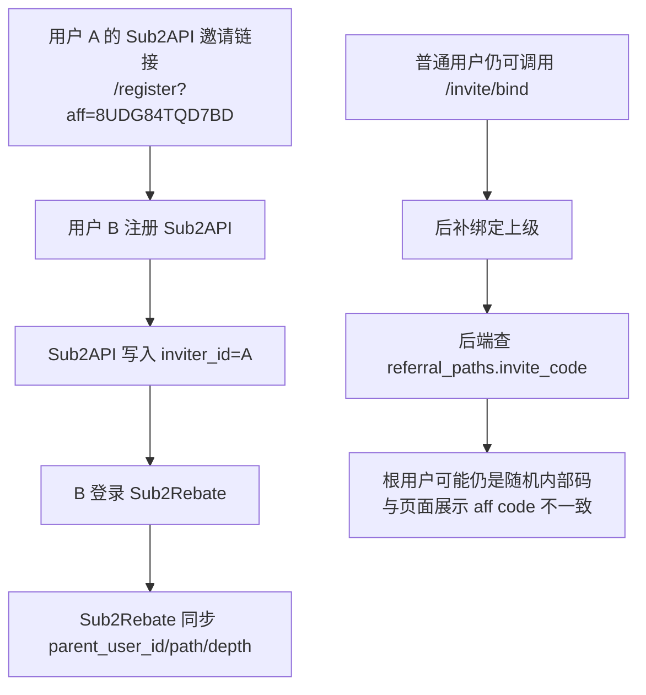
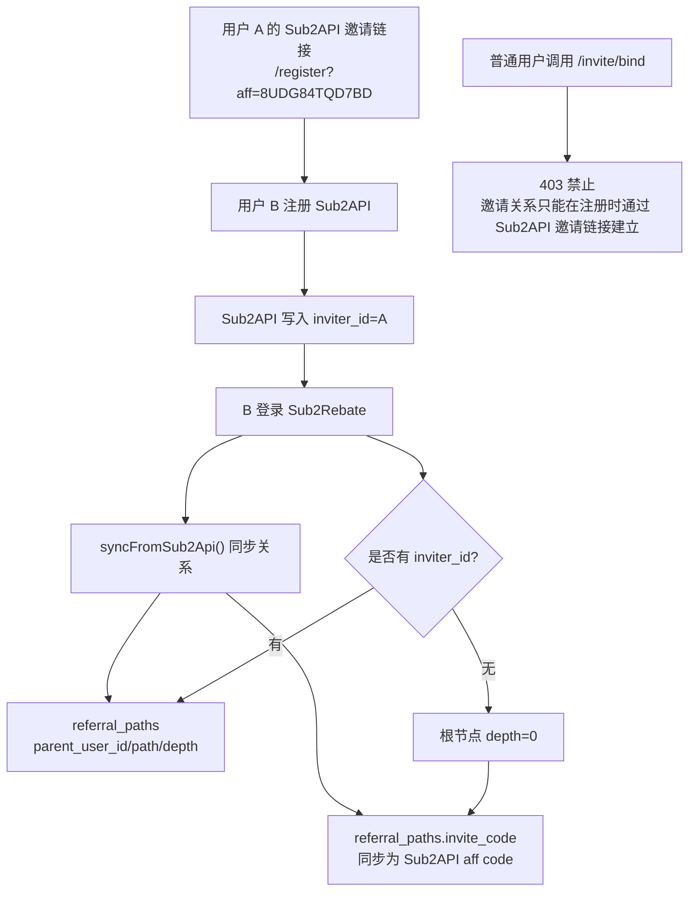

# 邀请关系修复日志

时间：2026-06-29  
范围：Sub2API 邀请注册关系同步、Sub2Rebate 多层级返利关系

## 修复前



问题：
- 业务规则应只认 Sub2API 注册时的 `inviter_id`，普通用户不应后补绑定上级。
- 根节点用户没有上级时，旧逻辑可能保留 `ensurePath()` 生成的随机 `invite_code`。
- 页面展示的是 Sub2API aff code，内部 `referral_paths.invite_code` 可能是另一套码，排查容易混乱。

## 修复后



结果：
- 用户关系来源统一为 Sub2API 注册链路。
- 未用邀请码注册的用户进入 Sub2Rebate 后是根节点。
- 普通用户无法后补绑定上级。
- 本系统内部 `referral_paths.invite_code` 与 Sub2API aff code 保持一致，便于审计和排查。

## 改动文件

| 文件 | 改动 |
| --- | --- |
| `backend/app/Modules/Invite/Http/Controllers/InviteController.php` | `/invite/bind` 对普通用户返回 403 |
| `backend/app/Modules/Invite/Services/InviteService.php` | `syncFromSub2Api()` 同步根用户和下级用户的 `invite_code` 为 Sub2API aff code |
| `backend/tests/Feature/InviteTest.php` | 增加后绑定禁用、根用户 aff code 同步测试；服务层绑定测试保留 |
| `backend/tests/Feature/DeepApiEndpointTest.php` | 更新 `/invite/bind` API 预期为 403 |
| `docs/ONLINE_ACCEPTANCE_TEST_2026-06-29.md` | 更新验收报告中的邀请关系结论 |

## 验证

```bash
../.tools/conda/php/bin/php artisan test --filter InviteTest
../.tools/conda/php/bin/php artisan test --filter DeepApiEndpointTest
../.tools/conda/php/bin/php artisan test --filter AuthAndProfileTest
```

结果：
- `InviteTest`：10 passed
- `DeepApiEndpointTest`：22 passed
- `AuthAndProfileTest`：10 passed
