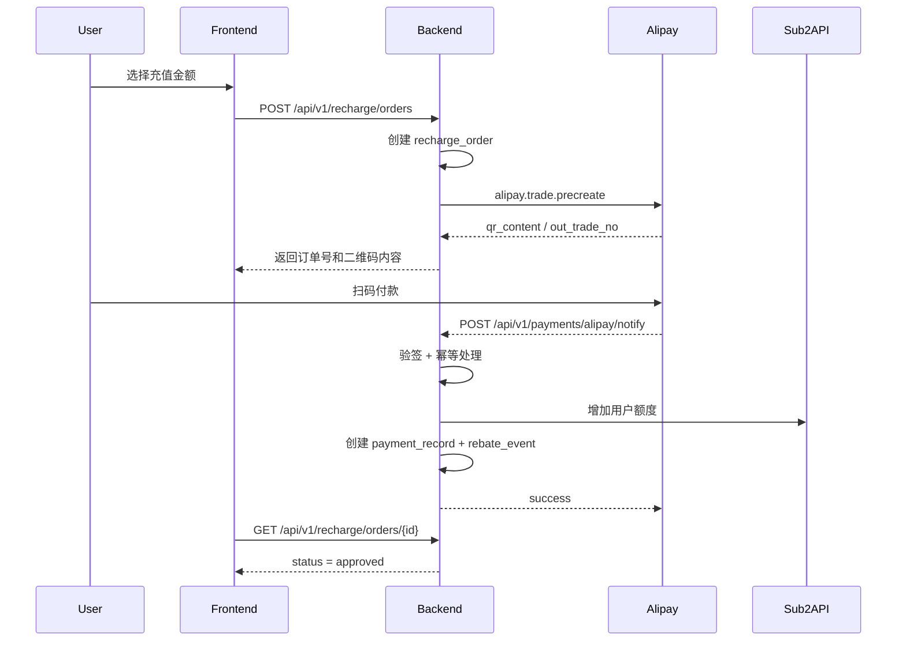
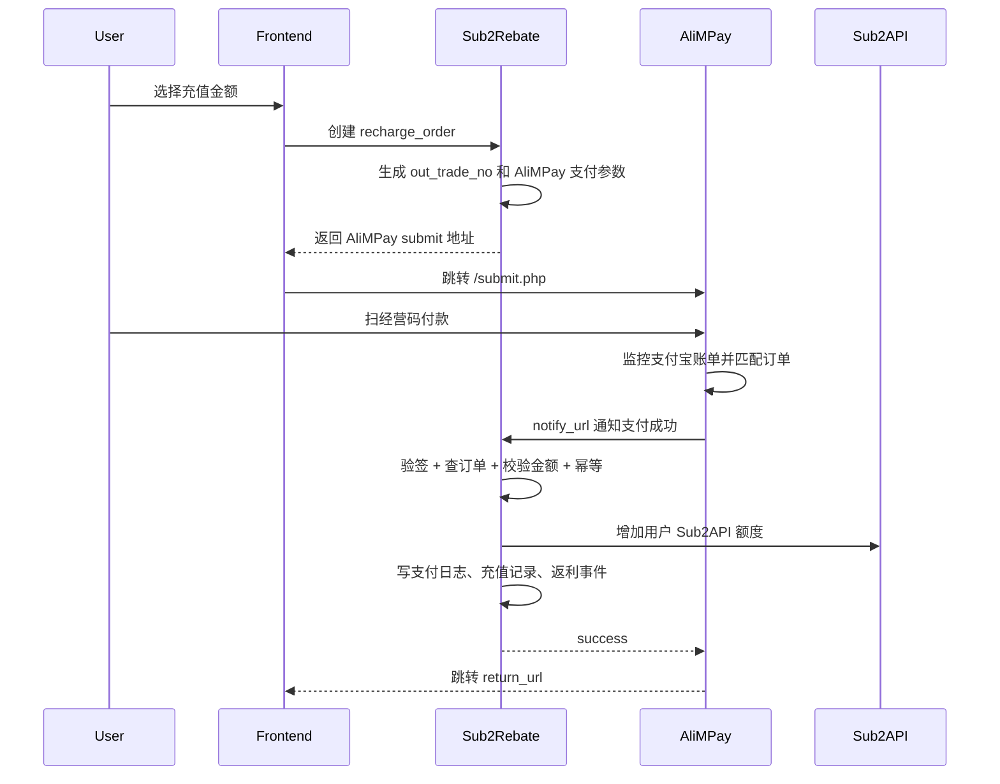

# Payment 模块：支付与充值

## 1. 模块目标

负责用户充值、支付记录，以及后续支付宝/微信收款能力接入。

## 2. 模块边界

本模块负责：

- 创建充值订单。
- 展示支付宝二维码收款配置。
- 记录用户提交的付款信息。
- 后台审核充值到账。
- 到账后调用 Sub2API 增加用户 API 额度。
- 生成返利事件。
- 记录外部充值/兑换事件的来源、原始金额、标准金额和换算配置快照。

本模块不负责：

- 返利分发。
- 提现。
- 邀请关系。

## 3. 当前实现范围

当前版本面向个人支付宝主体，采用“静态支付宝收款码 + 本地充值订单 + 人工审核到账”的方式，不依赖支付宝官方回调。

第一版涉及金额的入口保证：

- 充值订单有本地唯一订单号。
- 到账后统一通过 `RechargeEventService` 生成充值事件。
- 事件仍然使用 `source_type + source_id` 做幂等。
- 后台审核必须要求管理员身份和备注。
- `users.balance` / `users.total_recharged` 快照只用于对账或人工确认，不能直接自动发返利。

## 4. 订单状态

```text
pending   -> 已创建，待付款
submitted -> 用户已付款并提交付款信息，待审核
approved  -> 管理员确认到账，已加额度
rejected  -> 管理员拒绝
expired   -> 订单过期
```

## 5. 当前收款流程

```text
用户选择充值金额
-> 创建 recharge_order
-> 展示支付宝收款二维码
-> 用户扫码付款并备注订单号
-> 用户填写付款姓名 / 付款账号后提交
-> 管理员核对支付宝收款记录
-> 管理员确认到账
-> 调用 Sub2API 增加 API 额度
-> 创建 rebate_event
-> 返利链路继续按现有逻辑处理
```

## 6. 已完成

- 已实现 `payment_records` 表。
- 已实现 `rebate_events` 表。
- 已实现 `RechargeEventService` 服务层充值事件入口。
- 已新增 `recharge_orders` 表，用于记录二维码充值订单、付款信息、审核信息和关联返利事件。
- 已新增用户侧充值接口：
  - `GET /api/v1/recharge/config`
  - `POST /api/v1/recharge/orders`
  - `POST /api/v1/recharge/orders/{id}/submit`
  - `GET /api/v1/recharge/orders`
- 已新增后台充值审核接口：
  - `GET /api/v1/admin/recharge-orders`
  - `POST /api/v1/admin/recharge-orders/{id}/approve`
  - `POST /api/v1/admin/recharge-orders/{id}/reject`
- 已实现管理员确认到账后自动调用 Sub2API 增加额度，并复用 `RechargeEventService` 创建返利事件。
- 已新增前端充值页，支持展示支付宝二维码、创建本地充值订单、提交付款姓名和付款账号。
- 已新增后台“充值审核”页面，支持管理员审核到账或拒绝。
- 已新增后台“支付配置”页面，支持配置支付宝二维码地址、展示名、付款提示、订单有效期和额度换算比例。
- 已补充 `RechargeOrderFlowTest`，覆盖创建订单、提交付款信息、管理员确认到账、管理员拒绝。
- 已补充 `AdminPaymentConfigTest`，覆盖后台支付配置读取、保存和启用时二维码必填校验。

## 7. 还需要你提供的内容

要真正用起来，你还需要给我这几样：

1. 支付宝收款二维码图片
   - 可以在后台“支付配置”页面直接上传本地图片
   - 也可以提供对象存储、CDN、站内静态文件 URL

2. 充值页展示名称
   - 填到 `payment.alipay_display_name`
   - 例如：`张三-支付宝收款码`

3. 付款提示文案
   - 填到 `payment.qr_note`
   - 例如：`付款时请备注订单号，支付后等待管理员审核到账。`

4. Sub2API 管理配置
   - `SUB2API_BASE_URL`
   - `SUB2API_ADMIN_API_KEY`
   - 如果没有 API Key，就提供管理员账号密码

5. 是否保留当前赠送规则
   - 100 送 5
   - 200 送 15
   - 500 送 50
   - 1000 送 120

## 8. 后续可升级方向

后续如果你拿到正规商户 API，可继续升级为：

- 官方支付宝下单。
- 支付成功异步回调。
- 自动对账。
- 自动补单。
- 上传付款截图凭证。
- 微信二维码充值。

## 9. 开发记录

### 2026-06-16

- 目标：落地个人支付宝二维码充值 MVP。
- 完成：新增本地充值订单、用户提交付款信息、后台审核到账、到账后自动加额度并生成返利事件。
- 说明：这一版更适合个人主体，不依赖支付宝官方回调。

## 10. 支付宝官方回调版设计（升级方案）

> 这一版是从“个人静态收款码 + 人工审核”升级到“支付宝官方下单 + 异步回调自动入账”的方案。
> 只有拿到支付宝开放平台支付能力后才能直接落地；纯个人支付宝收款码本身不支持这条链路。

### 10.1 推荐产品形态

第一版建议接 `alipay.trade.precreate`（当面付预下单）：

- 跟现有充值页最接近，前端继续展示二维码即可。
- 每笔订单都有独立二维码，方便对账和幂等。
- 后端只需要保存 `out_trade_no`，再接异步回调。

移动端后续如果要跳支付宝收银台，可再扩 `page pay / wap pay`，但不建议第一版就一起做。

### 10.2 业务流程



### 10.3 状态设计

| 字段 | 值 | 说明 |
|---|---|---|
| `status` | `pending` | 本地订单已创建，待支付 |
| `status` | `paid` | 支付宝已确认支付成功，待入账或入账中 |
| `status` | `approved` | 已完成额度发放，并已创建返利事件 |
| `status` | `closed` | 超时关闭或支付宝关闭 |
| `status` | `failed` | 回调处理失败，需要人工补单 |
| `status` | `refunded` | 已退款 |
| `trade_status` | `WAIT_BUYER_PAY` | 支付宝未付款 |
| `trade_status` | `TRADE_SUCCESS` | 支付成功 |
| `trade_status` | `TRADE_CLOSED` | 交易关闭 |
| `trade_status` | `TRADE_FINISHED` | 交易结束 |
| `credit_status` | `pending` | 尚未发放额度 |
| `credit_status` | `success` | 已发放额度 |
| `credit_status` | `failed` | 支付成功但发放额度失败 |

### 10.4 表设计

#### A. `recharge_orders` 增补字段

在现有 `recharge_orders` 上继续扩，不单独再拆一张支付订单表。

| 字段 | 类型 | 说明 |
|---|---|---|
| `pay_mode` | string(30) | `manual_qr` / `alipay_precreate` |
| `provider` | string(30) | 支付提供方，固定 `alipay` |
| `out_trade_no` | string(64) unique | 发给支付宝的商户订单号 |
| `provider_trade_no` | string(64) nullable index | 支付宝交易号 `trade_no` |
| `subject` | string(120) | 订单标题，如 `API充值-100元` |
| `trade_status` | string(40) nullable index | 支付宝交易状态 |
| `credit_status` | string(20) default `pending` index | 入账状态 |
| `paid_amount` | decimal(18,6) nullable | 支付宝实际支付金额 |
| `buyer_logon_id` | string(120) nullable | 支付宝买家账号脱敏值 |
| `notify_id` | string(64) nullable index | 支付宝回调通知 ID |
| `notify_at` | timestamp nullable | 最近一次有效回调时间 |
| `last_query_at` | timestamp nullable | 最近一次后台查单时间 |
| `qr_content` | text nullable | `precreate` 返回的二维码原始内容 |
| `pay_url` | text nullable | 预留给后续 H5/收银台跳转 |
| `channel_config_snapshot` | json nullable | 下单时的支付配置快照 |
| `provider_payload` | json nullable | 预下单返回原始报文 |
| `notify_payload` | json nullable | 最近一次成功回调原始报文 |
| `closed_at` | timestamp nullable | 关闭时间 |
| `credit_fail_msg` | string(500) nullable | 入账失败原因 |

现有这些字段继续保留：

- `amount`
- `bonus_amount`
- `credit_amount`
- `rebate_event_id`
- `paid_at`
- `remark`

手动版专用字段在官方回调版里允许为空：

- `payer_name`
- `payer_account`
- `voucher_image_url`
- `submitted_at`
- `reviewed_by`
- `reviewed_at`
- `review_remark`

#### B. `payment_notify_logs` 新表

专门记录支付宝回调，方便查单、补单和审计。

| 字段 | 类型 | 说明 |
|---|---|---|
| `id` | bigint | 主键 |
| `provider` | string(30) | `alipay` |
| `event_type` | string(30) | 固定 `trade_notify` |
| `out_trade_no` | string(64) index | 商户订单号 |
| `provider_trade_no` | string(64) nullable index | 支付宝交易号 |
| `notify_id` | string(64) nullable index | 支付宝通知 ID |
| `trade_status` | string(40) nullable index | 支付宝交易状态 |
| `verify_passed` | boolean | 是否验签通过 |
| `handle_status` | string(20) | `pending` / `processed` / `ignored` / `failed` |
| `handle_msg` | string(500) nullable | 处理说明 |
| `payload` | json | 支付宝原始回调参数 |
| `received_at` | timestamp | 接收时间 |
| `handled_at` | timestamp nullable | 处理完成时间 |
| `created_at` | timestamp | 创建时间 |
| `updated_at` | timestamp | 更新时间 |

### 10.5 幂等规则

- `recharge_orders.out_trade_no` 全局唯一。
- 支付宝回调先按 `out_trade_no` 找本地订单，再核对 `total_amount` 和 `seller_id/app_id`。
- 如果订单已经是 `approved` 且 `credit_status = success`，回调直接返回 `success`，不重复加额度。
- `RechargeEventService` 继续使用 `source_type + source_id` 幂等，建议：
  - `source_type = recharge_order`
  - `source_id = recharge_orders.id`
- `payment_notify_logs` 保留每次回调原文，不拿它做唯一业务主键。

### 10.6 与现有返利链路的衔接

建议新建一个自动入账服务，例如 `RechargeCallbackService`，职责固定为：

1. 验签支付宝回调。
2. 更新 `recharge_orders` 为 `paid`。
3. 调用 `Sub2ApiAdminClient::updateUserBalance(...)` 发放额度。
4. 调用 `RechargeEventService::createRechargeEvent(...)` 写 `payment_records + rebate_events`。
5. 成功后把订单更新为 `approved`，并写入 `rebate_event_id`。
6. 如果第 3 或第 4 步失败，保留 `status = paid`、`credit_status = failed`，后台可重试，不回滚支付事实。

这样做的好处是：

- 支付成功和业务入账分开记录。
- 返利链路继续复用现有代码，不需要再造一套事件系统。
- 后台可以补单，不怕支付宝回调偶发丢失。

### 10.6.1 置灰用户充值恢复口子

后续真正接入支付成功回调时，需要在“支付已验签且确认成功、金额可信”的位置调用返利资格恢复口子：

```text
RebateEligibilityService::recordSuccessfulRecharge(user, paidAmount, paidAt)
```

业务规则：

- 只基于充值成功回调或后台确认到账后的可信充值金额恢复返利资格。
- 默认配置 `risk.lie_flat_restore_min_recharge = 10`。
- 被防躺平置灰的用户，单次成功充值金额 `>= risk.lie_flat_restore_min_recharge` 时恢复为 `eligible`。
- 小于该金额的充值只记录活跃时间，不恢复返利资格。
- Sub2API 余额监控里的 `total_recharged` 增长只能记录活跃时间，不能作为恢复返利资格或自动发返利依据。

当前个人二维码版本还没有自动支付成功回调；后台人工确认到账生成充值事件时已预留并复用该口子。正式回调版落地时，需要把同一口子接到 `RechargeCallbackService` 的成功处理流程中。

### 10.7 需要补充的配置项

继续沿用现有 `config_items`，不新建配置表，增加这些键即可：

- `payment.mode = alipay_precreate`
- `payment.alipay.enabled`
- `payment.alipay.app_id`
- `payment.alipay.private_key`
- `payment.alipay.public_key`
- `payment.alipay.notify_url`
- `payment.alipay.return_url`
- `payment.alipay.sign_type`
- `payment.alipay.seller_name`
- `payment.alipay.order_expire_minutes`

### 10.8 为什么这版适合以后升级

- 现在的个人二维码方案还能继续用，`pay_mode = manual_qr`
- 以后切官方接口，只需要把 `pay_mode` 切到 `alipay_precreate`
- 本地订单、赠送额度、Sub2API 加额度、返利事件都能继续复用
- 真正变化的只有“收款确认方式”：从人工审核切到支付宝异步回调

## 11. 当前进度与待审核项

### 2026-06-16

已完成：

- 已落地个人支付宝二维码充值 MVP。
- 用户端可以读取充值配置、创建充值订单、展示支付宝二维码、提交付款姓名和付款账号。
- 管理端可以配置支付宝收款二维码、展示名、付款提示、订单有效期和额度换算比例。
- 管理端可以审核充值订单，确认到账后自动调用 Sub2API 增加额度，并创建充值返利事件。
- 已补齐 `docs/API_CONTRACT.md` 中 10A 充值接口和后台支付配置接口口径。
- 本地已运行 `recharge_orders` 迁移，并验证前后端服务可启动。

已验证：

- `npm run build` 通过。
- `AdminPaymentConfigTest` 和 `RechargeOrderFlowTest` 共 6 条测试通过。
- `php artisan route:list --path=api/v1` 已确认包含充值订单、充值审核和后台支付配置接口。
- 本地真实管理员登录后，`GET /api/v1/admin/payment-config` 可正常读取。
- 临时写入测试二维码后，`GET /api/v1/recharge/config` 可读到同一份二维码配置；测试后已恢复为空。

待审核 / 待提供：

- 需要提供真实支付宝收款二维码图片，或在后台“支付配置”页面上传。
- 需要确认收款展示名，例如 `张三-支付宝收款码`。
- 需要确认付款提示文案是否沿用默认值。
- 需要提供 Sub2API 管理凭据：优先 `SUB2API_ADMIN_API_KEY`，或 `SUB2API_ADMIN_EMAIL` / `SUB2API_ADMIN_PASSWORD`。
- 需要确认赠送规则是否继续使用：100 送 5、200 送 15、500 送 50、1000 送 120。
- 当前个人支付宝二维码模式没有官方支付回调，到账仍需管理员人工审核。

## 12. AliMPay/经营码支付通道接入方案

> 2026-06-24 已完成 AliMPay 经营码真实 1 元公网回调验证。AliMPay 不建议当作“页面插件”直接硬塞进充值页，而应作为独立支付通道接入分销系统。

### 12.1 推荐定位

新增支付方式：`alimpay_qr`，后台展示名可配置为 `AliMPay/经营码`。

核心边界：

- 分销系统负责创建充值订单、记录用户、充值金额、Sub2API 入账和返利。
- AliMPay 负责经营码展示、支付宝账单查询、金额匹配和发起支付通知。
- 分销系统新增独立通知入口接收 AliMPay 的 CodePay/易支付风格回调。

不要复用当前支付宝官方 RSA 回调入口。AliMPay 通知格式是 CodePay/易支付 MD5 签名，和支付宝官方异步回调不是同一种协议。

### 12.2 推荐流程



### 12.3 分销系统需要新增的能力

- 新增 AliMPay 支付通道配置：商户 `pid`、商户 `key`、AliMPay 地址、启用状态、超时时间、展示名称。
- 新增 CodePay/易支付风格通知入口，例如 `POST/GET /api/v1/payments/alimpay/notify`。
- 通知入口独立做 MD5 验签，不走支付宝官方 RSA 验签逻辑。
- 充值订单保存 `pay_channel = alimpay_qr`、`out_trade_no`、`paid_amount`、`provider_trade_no`、`notify_payload`、`paid_at`、`credited_at`。
- 用户支付页只轮询分销系统订单状态，不直接依赖 AliMPay 前端状态。
- 正式环境由服务端定时任务或队列保证回调失败后的补偿，不依赖用户浏览器触发。

### 12.4 用户端支付日志

用户端只展示自己的充值记录，字段建议：

- 本地充值订单号。
- 支付订单号 `out_trade_no`。
- 支付金额。
- 原始充值金额。
- 赠送金额或活动金额。
- 入账前 Sub2API 金额。
- 入账后 Sub2API 金额。
- 支付状态：待支付、已支付、入账中、已入账、失败、已关闭。
- 支付通道：AliMPay/经营码。
- 创建时间、支付时间、入账时间。
- 失败原因的用户可读摘要。

用户端不要展示内部回调报文、验签细节、商户 key、账单查询错误堆栈。

### 12.5 管理端支付日志

管理端需要能排查和补单，字段建议：

- 用户 ID、用户账号、充值订单号、`out_trade_no`。
- 支付金额、订单金额、到账金额、匹配金额。
- 原 Sub2API 金额、充值后 Sub2API 金额、实际增加金额。
- 支付通道、商户 `pid`、AliMPay 账单流水号或 `trade_no`。
- AliMPay 匹配时间、通知时间、通知次数、最近一次通知结果。
- 验签结果、金额校验结果、订单状态变更记录。
- 原始回调摘要，敏感字段脱敏后保存。
- Sub2API 入账请求结果、失败原因、重试次数。
- 管理员手动补单、重试入账、关闭订单、标记异常的操作日志。

### 12.6 安全要求

- 必须校验 AliMPay/CodePay MD5 签名。
- 必须校验 `pid` 是当前配置的商户 ID。
- 必须用本地订单查 `out_trade_no`，不能只相信回调里的金额和状态。
- 必须校验订单金额与回调金额一致。
- 必须做幂等：同一订单、同一支付宝流水重复通知只能入账一次。
- 支付成功和 Sub2API 入账要放在事务或可恢复的状态机里，避免“钱到了但额度没加”。
- 对订单行加锁，避免并发回调重复加额度。
- `notify_url` 和 `return_url` 使用 HTTPS 公网地址。
- 密钥、真实经营码图片、账单数据、日志禁止提交到 Git。
- 回调接口加频率限制和审计日志，但不要只靠来源 IP 判断真假。
- 失败通知进入重试队列，连续失败要给管理端告警。

### 12.7 最小改动接入路径

第一阶段先保守接入：

1. 保留现有手工二维码充值流程。
2. 新增 `alimpay_qr` 支付通道配置。
3. 创建订单后生成 AliMPay submit URL，用户跳转支付。
4. 新增 AliMPay notify 入口，验签后复用现有充值入账服务。
5. 用户端充值记录新增 AliMPay 状态展示。
6. 管理端新增 AliMPay 支付日志和手动重试入账。

第二阶段再优化：

- 将 AliMPay 账单监控迁移为服务端常驻任务或队列任务。
- 做自动补单和异常订单告警。
- 做多支付通道统一支付日志。
- 做退款、关闭订单、人工冲正流程。
